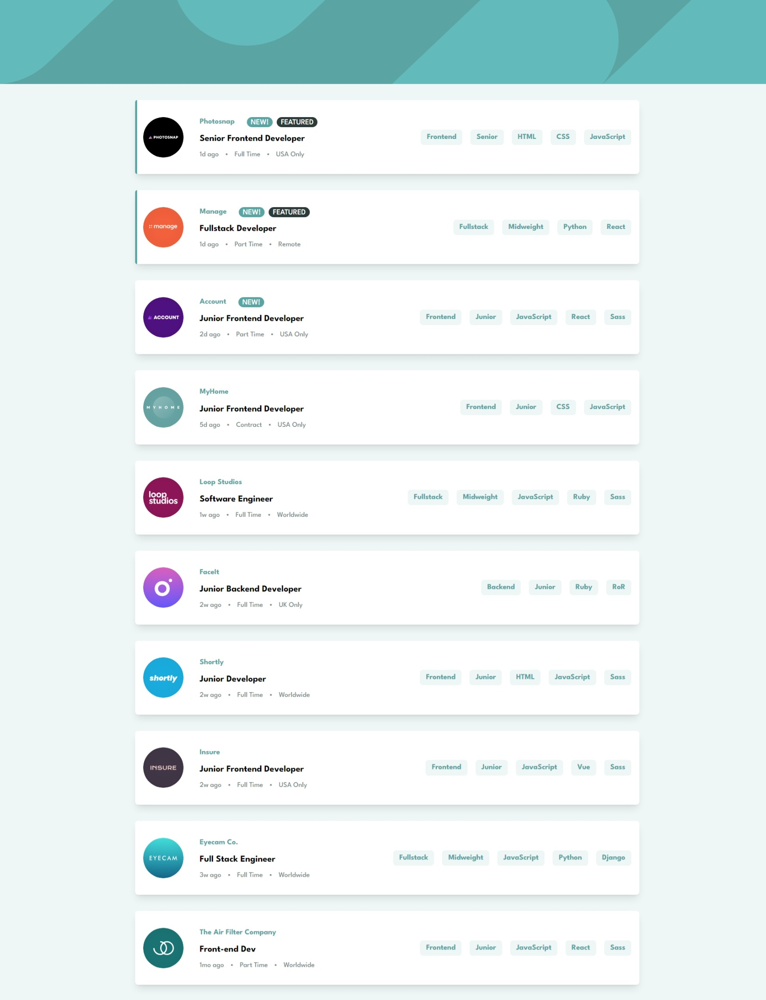
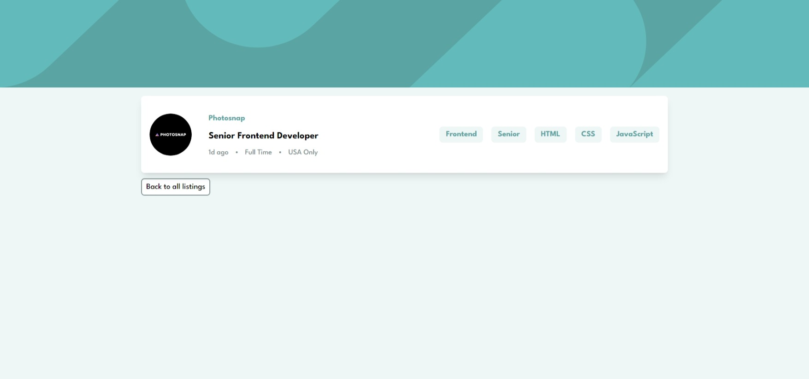

# Frontend Mentor - Job listings with filtering solution

In this [Frontend Mentor](https://www.frontendmentor.io/challenges/job-listings-with-filtering-ivstIPCt) job listings project, I focused on making things work smoothly using React hooks. I used hooks like useState and useEffect to handle the app's actions and data effectively. With the help of useLocation, useSearchParams, and useParams, I managed the URL information to let users easily filter job listings. Though design was simple, the project taught me how to create a user-friendly experience by prioritizing functionality. It improved my React skills and showed me the power of hooks for dynamic web apps.

### Screenshot

##### Home page



##### Show listing page



### Links

- Live Site URL: [https://job-listings-react-tailwind.netlify.app](https://job-listings-react-tailwind.netlify.app)

### Built with

- Reactjs Router
- React hooks [useState, useeffect, useLocation, useSearchParams, useParams]
- Tailwindcss
- Flexbox
- Semantic HTML5 markup
- Mobile-first workflow

### What I learned

In this job listings project, I learned how to use useLocation and URLSearchParams in React. These tools helped me manage query parameters from the URL and create a user-friendly job search experience.

### Some code of URLSearchParams()

```js
function removeFilter(filterName) {
  const newQuery = new URLSearchParams("");
  searchParams.forEach((value, key) => {
    if (value != filterName) {
      newQuery.append(key, value);
    }
  });

  setSearchParams(newQuery);
}
```

### Useful resources

- [URLSeachParams](https://developer.mozilla.org/en-US/docs/Web/API/URLSearchParams) - This helped me for working with SearchParams JavaScript

## Author

- Twitter - [Karim_aoulallay](https://twitter.com/karim_aoulallay)
- Frontend Mentor - [@karim_aoulallay](https://www.frontendmentor.io/profile/karimode)
